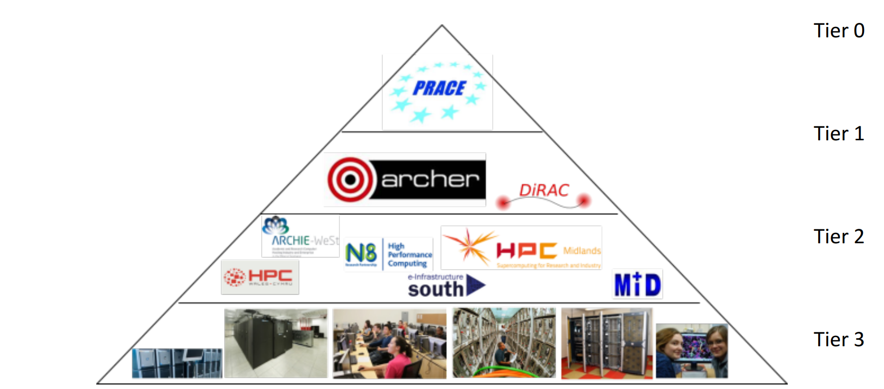
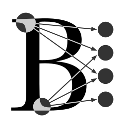
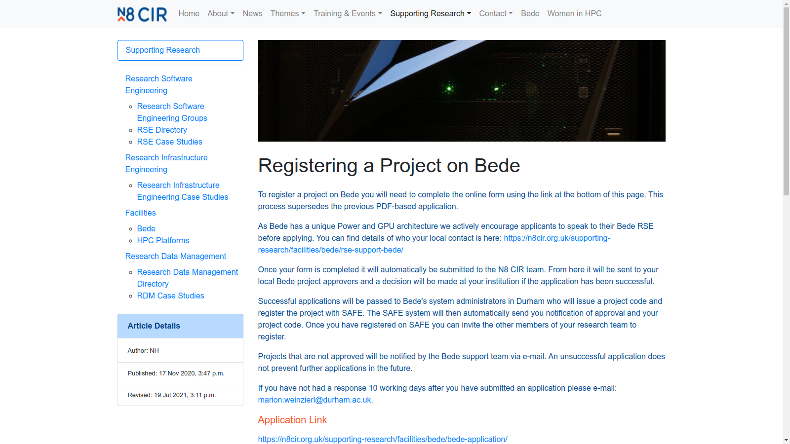
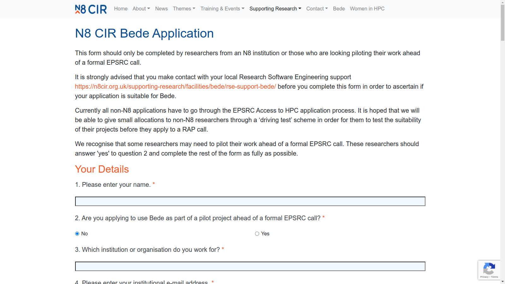

<!-- markdownlint-disable MD033 -->
<!-- markdownlint-disable MD025 -->

<style type="text/css">
.logo-grid-ish img {
  height: 140px;
  margin: 32px;
}
.logo-grid-ish img.very-faded {
  opacity: 0.05;
}

.reveal pre.code-wrapper {
  width: 55%;
  margin: 64px auto;
}
.reveal pre.code-wrapper > code {
  padding: 2rem;
  font-size: 2rem;
  line-height: 2.1rem;
  max-height: 800px;
}

div.three-col {
  display: flex;
  flex-wrap: wrap;
}

div.three-col > .one-third {
  flex-grow: 1;
  width: 33%;
}
.reveal div.three-col pre.code-wrapper {
  width: 95%;
  margin: 16px auto;
}

div.three-col > .one-third h3 {
  font-size: 2.5rem;
}

.reveal h2, .reveal h3, .reveal h4 {
  text-transform: none;
}

.reveal .bigger-content p {
  font-size: 3.6rem;
}
</style>

# HPC Beyond Sheffield: 
# JADE and Bede 

<br />

Peter Heywood

Research Software Engineer

[ <!-- .element: style="vertical-align:middle; height:48px;" --> github.com/ptheywood](https://github.com/ptheywood)

note:
Introduce self

* Tier 2 HPC Overview
* JADE
* Bede
* Which HPC Resource Should I Use?
* Accessing Tier 2 HPC Resources
* Using Tier 2 HPC

---

## Overview

<!-- .slide: data-visibility="hidden" -->

* Tier 2 HPC Overview
* JADE
* Bede
* Which HPC Resource Should I Use?
* Accessing Tier 2 HPC Resources
* Using Tier 2 HPC

---

## UK HPC Tiers

<!-- .slide: data-background="#ffffff" -->



[Source: epsrc.ukri.org/files/research/tier2hpcstrategy](https://epsrc.ukri.org/files/research/tier2hpcstrategy/)

note: T3 local like ShARC and Bessemer
T2 are regional systems, usually larger or specialised
T1 are national scale, very large systems
T0 are international

--

## UK Tier 2 HPC

<!-- .slide: data-background="#ffffff" -->
<!-- .slide: data-transition="slide-in fade-out" -->
<!-- .slide: class="logo-grid-ish" -->




[hpc-uk.ac.uk/facilities/](https://www.hpc-uk.ac.uk/facilities/)

note: These are some of the Tier-2 facilities in the UK

as listed on the hpc-uk.ac.uk website

Most of these can be accessed if appropriate

--

## UK Tier 2 HPC

<!-- .slide: data-background="#ffffff" -->
<!-- .slide: data-transition="fade-in" -->
<!-- .slide: class="logo-grid-ish" -->

<!-- @todo - use css  propperly rather than horrible per element height and opacity. -->

 <!-- .element: class="very-faded"-->
 <!-- .element: class="very-faded"-->
 <!-- .element: class="very-faded"-->

 <!-- .element: class="very-faded" -->

 <!-- .element: class="very-faded"-->

 <!-- .element: class="very-faded"-->

 <!-- .element: class="very-faded"-->

[hpc-uk.ac.uk/facilities/](https://www.hpc-uk.ac.uk/facilities/)


note: But at sheffield we have more-direct access to the JADE and Bede systems

Which are free at the point of use, and open to all departments, as long as your project fits certain criteria

---

<!-- .slide: data-background="#ffffff" -->


[www.jade.ac.uk](https://www.jade.ac.uk)

--

## JADE

Joint Academic Data Science Endeavour (JADE)

Machine Learning and Molecular Dynamics

NVIDIA V100 Max Q GPU + x86 CPUs

[Funded by EPSRC Grant EP/T022205/1](https://gow.epsrc.ukri.org/NGBOViewGrant.aspx?GrantRef=EP/T022205/1)

**Free at point-of-use and open to all departments!**

--

63 NVIDIA MAXQ Deep Learning Systems

* Intel + V100 max-Q
* 8 GPUs per node
* Jobs can use up to a single node
* Molecular Dynamics + Machine Learning

--

## JADE

<iframe src="http://www.jade.ac.uk/" height="900" width="1600"></iframe>

[www.jade.ac.uk](https://www.jade.ac.uk/)

--

## JADE

<iframe src="http://docs.jade.ac.uk/" height="900" width="1600"></iframe>

[docs.jade.ac.uk](https://docs.jade.ac.uk/)

---

<!-- ## Bede -->

<!-- .slide: data-background="#ffffff" -->

<!--  -->


[n8cir.org.uk/bede](n8cir.org.uk/bede/)

--

## Bede

**Free at point-of-use and open to all departments!**

* N8 CIR
* Power 9 + V100 with NVLink between CPU and GPU
* 4 GPUs per node
* 32 V100 nodes (+ 4 T4 Nodes)
* multi-node jobs supported!
* Any GPU workload!
* Especially well suited for large distributed workloads + workloads which move a lot of data to / from CPU

[Funded by EPSRC Grant EP/T022167/1](https://gow.epsrc.ukri.org/NGBOViewGrant.aspx?GrantRef=EP/T022167/1)

--

But Power9 CPU architecture prevents some workloads

* Not all software available
  * I.e. Matlab does not support IBM Power systems.
* Potential compilation issues
  * Although  none encountered so far.
* Singularity containers must be built for Power9 hosts

--

## Bede

 <!-- .element: width="1600px" -->

[n8cir.org.uk/bede](https://n8cir.org.uk/bede/)

--

## Bede

<iframe src="https://bede-documentation.readthedocs.io" height="900" width="1600"></iframe>

[bede-documentation.readthedocs.io](https://bede-documentation.readthedocs.io)

---

## Which GPU HPC Resource Should I Use?

Note: When deciding which HPC resource is most appropriate, there are several things to consider.

--

## Are my jobs allowed on the system?

| Domain                 | JADE     | Bede     |     TUoS |
|------------------------|:--------:|:--------:|:--------:|
| **Machine Learning**   | &#10003; | &#10003; | &#10003; |
| **Molecular Dynamics** | &#10003; | &#10003; | &#10003; |
| **Other**              | &#10008; | &#10003; | &#10003; |

Note: Is my workload allowed on the cluster?

For Bede and the local Tier 3 systems, any problem domain is allowed

While JADE is limited to Machine Learning and Molecular Dynamics applications, although this will include a significant number of GPU workloads.

--

## How many GPUs can I use at once?

| Scale                           | JADE     | Bede     | TUoS                                  |
|---------------------------------|:--------:|:--------:|:-------------------------------------:|
| **CPU-only**                    | &#10008; | &#10008; | &#10003;<sup><code>&nbsp</code></sup> |
| **Single-GPU**                  | &#10003; | &#10003; | &#10003;<sup><code>&nbsp</code></sup> |
| **Single-Node Multi-GPU**       | 8        | 4        | 4<sup><code>*</code></sup>            |
| **Multi-Node &nbsp; Multi-GPU** | &#10008; | &#10003; | &#10008;<sup><code>†</code></sup>     |

<br />
<br />
<small>* ShARC's K80 nodes contain 8 GPUs and private P100 node contains 7 GPUs. </small>

<br />
<small>† ShARC's K80 nodes support multi-node. Bessemer's V100 nodes do not.</small>

Note: How many GPUs do my jobs need or benefit from?

If you do not need GPUs, then neither of the easy-access T2 systems are appropriate.

If you only need a single GPU or a few GPUs within a single node, you can use any of the systems

But if you need more than 4 modern GPUs, then JADE is appropriate up to 8, or you could use Bede for multi-node jobs.

--

## Which system has the most GPUs?

| GPU Capacity        | JADE     | Bede                                | Bessemer | Private Bessemer* |
|---------------------|---------:|------------------------------------:|---------:|------------------:|
| **GPU Nodes**       |       63 |    38<sup><code>†</code></sup>      |        1 |                12 |
| **GPUs per Node**   |        8 |     4<sup><code>&nbsp;</code></sup> |        4 |                 4 |
| **Total GPUs**      |      504 |   152<sup><code>&nbsp;</code></sup> |        4 |                48 |
| **Maximum per Job** |        8 |   128<sup><code>‡</code></sup>      |        4 |                 4 |

<br />
<br />
<small>* Private GPUs may be available via preemptable jobs</small>

<br />
<small>† Includes 2 Interactive nodes, 32 V100 compute nodes and 4 T4 infer nodes</small>

<br />
<small>‡ Large multi-node jobs may queue for a <strong>very long</strong> time</small>

--

## Does data movement slow down my jobs? <!-- .element: class="r-fit-text" -->

| Data movement           | JADE     | Bede     | TUoS                                   |
|-------------------------|:--------:|:--------:|:--------------------------------------:|
| **GPU-GPU NVLink**      | &#10003; | &#10003; | &#65374;<sup><code>*</code></sup>      |
| **CPU-GPU NVLink**      | &#10008; | &#10003; | &#10008;<sup><code>&nbsp;</code></sup> |

<br />
<br />
<small>* Some UoS GPU nodes support GPU-GPU NVLink</small>

Note: 

---

### Getting Access: JADE

<iframe src="https://docs.hpc.shef.ac.uk/en/latest/other-uk-hpc-resources/jade2.html" height="900" width="1600"></iframe>

[docs.hpc.shef.ac.uk/other-uk-hpc-resources/jade2.html](https://docs.hpc.shef.ac.uk/en/latest/other-uk-hpc-resources/jade2.html)

--

### Getting Access: JADE

<iframe src="https://bit.ly/jade2-access" height="900" width="1600"></iframe>

[bit.ly/jade2-access](https://bit.ly/jade2-access)

Note: A member of the RSE team (probably Twin) will then be in touch.

--

### Getting Access: JADE

<iframe src="https://www.jade.ac.uk/access/" height="900" width="1600"></iframe>

[www.jade.ac.uk/access](https://www.jade.ac.uk/access/)

Note: More information can be found on the jade.ac.uk website

--

<!-- ### Getting Access: JADE -->

tier-2-hpc-support-group@sheffield.ac.uk <!-- .element: class="r-fit-text" -->

note: If in doubt, get in touch.

---

### Getting Access: Bede

<iframe src="https://docs.hpc.shef.ac.uk/en/latest/other-uk-hpc-resources/bede.html" height="900" width="1600"></iframe>

[docs.hpc.shef.ac.uk/en/latest/other-uk-hpc-resources/bede.html](https://docs.hpc.shef.ac.uk/en/latest/other-uk-hpc-resources/bede.html)

--

### Getting Access: Bede



[n8cir.org.uk/supporting-research/facilities/bede/docs/bede_registrations](https://n8cir.org.uk/supporting-research/facilities/bede/docs/bede_registrations/)

Note: Bede - fill in the form, get in touch if needed. Some restrictions.

--

### Getting Access: Bede

<!-- <iframe src="https://n8cir.org.uk/supporting-research/facilities/bede/bede-application/" height="900" width="1600"></iframe> -->



[n8cir.org.uk/supporting-research/facilities/bede/bede-application](https://n8cir.org.uk/supporting-research/facilities/bede/bede-application/)

Note: Bede - fill in the form, get in touch if needed. Some restrictions.

This is a relatively thorough form, get in touch with us if you need any help.

--

tier-2-hpc-support-group@sheffield.ac.uk <!-- .element: class="r-fit-text" -->

note: If in doubt, get in touch.

---

### Getting Access: Other HPC facilities

<iframe src="https://docs.hpc.shef.ac.uk/en/latest/other-uk-hpc-resources.html" height="900" width="1600"></iframe>

[docs.hpc.shef.ac.uk/en/latest/other-uk-hpc-resources.html](https://docs.hpc.shef.ac.uk/en/latest/other-uk-hpc-resources.html)

note: If ShARC, Bessemer, Bede or Jade do not meet your needs, there are routes to gain access to other UK HPC facilities.

The first place to look is the "Other UK hpc resources" page of docs.hpc.shef.ac.uk website

--

### EPSRC Access to HPC Calls

<iframe src="https://www.ukri.org/opportunity/access-to-high-performance-computing/" height="900" width="1600"></iframe>

[ukri.org/opportunity/access-to-high-performance-computing](https://www.ukri.org/opportunity/access-to-high-performance-computing/)

note: EPRSC have been running calls for access ~ twice a year, for Tier 1 & Tier 2

---

## Using JADE and Bede

Note: Using the JADE and Bede is very similar to using Bessemer

--

## Using JADE and Bede: SSH

```bash
# JADE2
ssh USERNAME@jade2.hartree.stfc.ac.uk
```

```bash
# Bede
ssh USERNAME@login1.bede.dur.ac.uk
```

```bash
# Bessemer
ssh USERNAME@bessemer.shef.ac.uk
```

Note: All systems are connected to via ssh

--

## Using JADE and Bede: Module Environments

```bash
# List available modules
module avail

# Print module whatis information
module whatis <module>

# Load a module by name
module load <module>

# Remove / Unload a module 
module unload <module>

# List loaded modules
module list

# Show module details
module show <module>
```

[modules.readthedocs.io](https://modules.readthedocs.io/en/latest/)

--

## Using JADE and Bede: Slurm

```bash
# List queued jobs for $USER
squeue -u $USER
```

```bash
# Submit a batch job
sbatch job.sh
```

 <!-- .element: height="300px" style="background:#fff; padding: 40px;" -->

Note: The 3 systems all use Slurm for job scheduling, so commands are very similar

--

## Using JADE and Bede: Batch Jobs

<div class="three-col">

<div class="one-third">

### JADE

```slurm
#! /usr/bin/env bash

#SBATCH --partition=small


#SBATCH --time=12:00:00
#SBATCH --nodes=1
#SBATCH --gres=gpu:1


# Run commands
module load cuda
nvcc --version
```

</div>
<div class="one-third">

### Bede

```slurm
#! /usr/bin/env bash

#SBATCH --partition=gpu
#SBATCH --account=<project>

#SBATCH --time=12:00:00
#SBATCH --nodes=1
#SBATCH --gres=gpu:1


# Run commands
module load cuda
nvcc --version
```

</div>
<div class="one-third">

### Bessemer

```slurm
#! /usr/bin/env bash

#SBATCH --partition=gpu
#SBATCH --qos=gpu

#SBATCH --time=12:00:00
#SBATCH --nodes=1
#SBATCH --gpus-per-node=1
#SBATCH --cpus-per-gpu=10
#SBATCH --mem=48G

# Run commands
module load CUDA
nvcc --version
```

</div>
</div>

<br />

* `1` GPU
* `1/NGPUs` of the node's CPUs and memory
* 12 hour max runtime
* Loads the default CUDA module

Note: Batch jobs are the prefferred (or only) mechanism for running GPU jobs on the systems

In general, batch scripts will be very similar, but with small / subtle differences

--

## Using JADE and Bede: Containers

```bash
singularity exec path/to/image.sif exec <command>
```

  <!-- .element: height="300px" -->

<span>* Extra steps required for Bede due to PPC64LE CPU architecture</span>

---

## Next Steps

<!-- .slide: class="bigger-content" -->

<br />

[docs.hpc.shef.ac.uk](https://docs.hpc.shef.ac.uk/)

<br />

[tier-2-hpc-support-group@sheffield.ac.uk](mailto:tier-2-hpc-support-group@sheffield.ac.uk)

<br />

Book a Code Clinic:

[rse.shef.ac.uk/support/code-clinic](https://rse.shef.ac.uk/support/code-clinic)

<br />

 <!-- .element: height="180px;" style="margin-left: 0px; margin-right: 260px"-->
 <!-- .element: height="180px;" -->

note:

If you need to find any more information, head to the Sheffield HPC Documentation as a first point of call.

Alternatively, email tier-2-hpc-support-group@sheffield.ac.uk which will reach a member of the RSE group or IT Services.

You can also book a code-clinic session for a 1:1 chat about any programming problems, or advice on best practice or using HPC.

---

## Extra Slides

<!-- .slide: data-visibility="uncounted"--->

--

## How long can my jobs run for?

<!-- .slide: data-visibility="uncounted"--->

| Scale          | JADE               | Bede   | Bessemer   |
|----------------|:------------------:|:------:|:----------:|
| **Single-GPU** | 6 days             | 2 days | 7 days     |
| **Multi-GPU**  | 1 day&nbsp;&nbsp;  | 2 days | 7 days     |

<br />

Check-pointing can enable longer running experiments